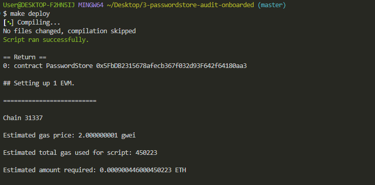
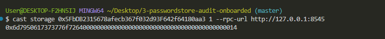
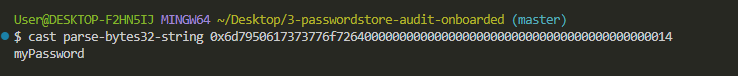
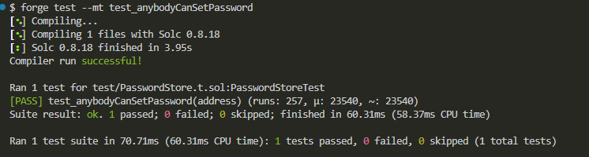

## [H-1] Passward stored onchain is vissble to anyone()Not Private.

**Description:** Variables in storage onchain are public to anybody, irrespective of visibility. The `PasswordStore:: s_password` variable is intended to be private and retrievable through the `PasswordStore function: gePassword()`. This function is intended to be only called by the owner of the contract.

**Impact:** Anyone can read the private password, Which defeats the essence of the protocol.

**Proof of Concept:** (Proof through code)
The test below shows that the code can be read onchain.


---





**Recommended Mitigation:**
Encrypt the password off-chain and then store it on-chain, probably retrievable via another password.

## [H-2] `PasswordStore:: setPassword()` Any user can set a password.--Missing access control.

**Description:** The essence of this contract is to allows only the owner to retrieve the password. but there are no access control here.

```javascript 
 function getPassword() external view returns (string memory) {
        if (msg.sender != s_owner) {
            revert PasswordStore__NotOwner();
        }
        return s_password;
    }
```

**Impact:** Anyone can set or change a password and severely break the contract.

**Proof of Concept:** Add the following to the `PasswordStore.t.sol` test file.
<details>

<summary>Code Details</summary>

```javascript

 function test_anybodyCanSetPassword(address randomAddress) public{

        vm.assume(randomAddress != owner);

        vm.prank(randomAddress);
        string memory expectedPassword = "myNewPassword";
        passwordStore.setPassword(expectedPassword);

        vm.prank(owner);
        string memory actualPassword = passwordStore.getPassword();
        assertEq(actualPassword, expectedPassword);

    }

```

Resultant test: 


</details>

---

**Recommended Mitigation:** Add an access control conditional to the `setPassword` function

```javascript

if(msg.sender != owner){
    revert PassWordStore_NotOwner();
}
```

## [Informational-NC-3] `PasswordStore::getPassword` No new password parameter.

**Description:** The `PasswordStore::getPassword` function signature is `getPassword()`, while the natspec indicate it shuld be `PasswordStore::getPassword(string)`

```javascript
 /*
     * @notice This allows only the owner to retrieve the password.
     * @param newPassword The new password to set.
     */
    //@audit, there is no new password parameter.
```

**Impact:** The natspec is incorrect

**Proof of Concept:**

**Recommended Mitigation:** Remove the natspec line.

```diff
-    * @param newPassword The new password to set.
```
